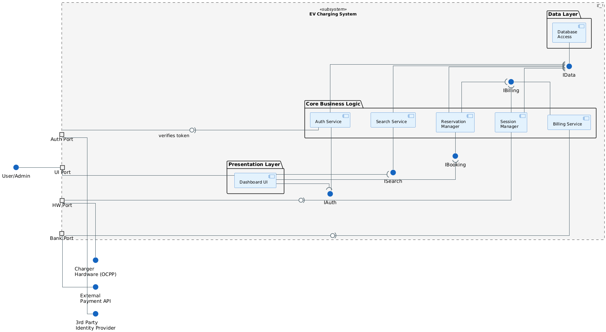
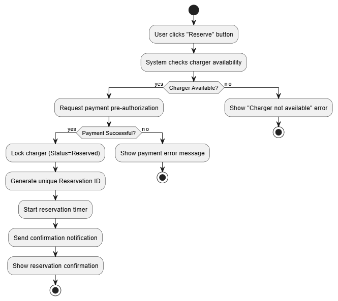
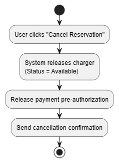
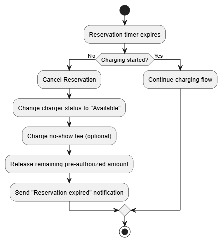
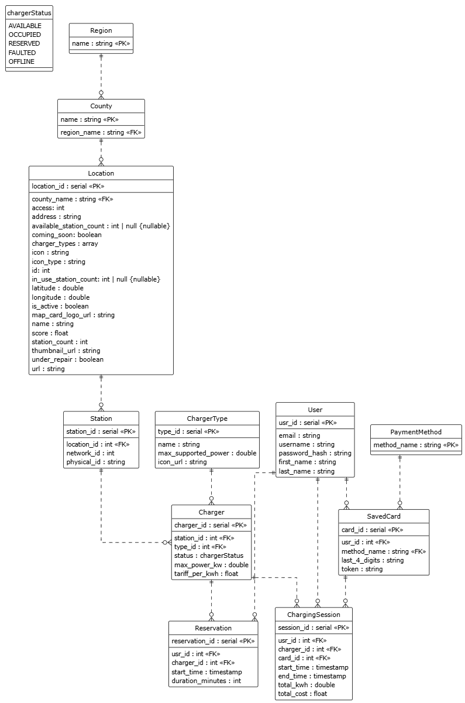

# EVCharge Manager

## Προδιαγραφή Απαιτήσεων Λογισμικού (SRS)

---

## 1. Εισαγωγή

### 1.1 Σκοπός

Σκοπός του παρόντος εγγράφου είναι ο καθορισμός των απαιτήσεων για την ανάπτυξη μιας ολοκληρωμένης πλατφόρμας διαχείρισης δικτύου φορτιστών ηλεκτρικών οχημάτων. Το σύστημα στοχεύει στην εξυπηρέτηση των οδηγών ηλεκτρικών οχημάτων (εύρεση, φόρτιση, πληρωμή) και στην παροχή εργαλείων διαχείρισης στον πάροχο του δικτύου.

#### Ενδιαφερόμενα Μέρη (Stakeholders):

| Ρόλος | Περιγραφή |
|-------|-----------|
| **Πελάτες (EV Drivers)** | Τελικοί χρήστες που φορτίζουν τα οχήματά τους |
| **Πάροχος (CPO - Charge Point Operator)** | Διαχειριστής του δικτύου φορτιστών |
| **Ομάδα Ανάπτυξης** | Υπεύθυνοι για την υλοποίηση και συντήρηση του λογισμικού |

### 1.2 Διεπαφές

#### 1.2.1 Διεπαφές με εξωτερικά συστήματα

Το λογισμικό αλληλεπιδρά με τα εξής εξωτερικά συστήματα:

- **Identity Providers:** Για τη δημιουργία και τη σύνδεση χρήστη μέσω 3rd parties (όπως Google, META, Apple) 
- **Συστήματα Πληρωμών (Payment Gateways):** Για την προ-δέσμευση ποσών και την υλοποίηση συναλλαγών.
- **Υπηρεσίες Χαρτών (Maps/Navigation):** (π.χ. Google Maps) Για απεικόνιση του δικτύου και την πλοήγηση προς τους φορτιστές.
- **Τρίτες Εφαρμογές (Aggregators):** Εξουσιοδοτημένες εφαρμογές που αντλούν δεδομένα κατάστασης φορτιστών.

\
**Πρότυπα & Πρωτόκολλα:**
- OCPP (Open Charge Point Protocol): Για την επικοινωνία των φορτιστών με το backend μέσω websockets. 
- HTTPS/TLS 1.3: Για ασφαλή δικτυακή επικοινωνία με το backend/ τους φορτιστές μέσω REST API (JSON/CSV).
- PCI-DSS: Πρότυπα ασφαλείας για προστασία προσωπικών δεδομένων και atomic τραπεζικές συναλλαγές (ACID).
- OAuth : Για την ασφαλή ταυτοποίηση του χρήστη κατά την είσοδό του στην εφαρμογή.

**Component Diagram**

#### 1.2.2 Διεπαφές Χρήστη

**FIXME : Οπωσδήποτε οθόνες και ενδεχομένως κάποιο chart που να δείχνει τη μετάβαση από τη μία οθόνη στην άλλη "    - Flow between screens, etc."**

Η διεπαφή χρήστη αφορά κυρίως την δικτυακή εφαρμογή για τον πελάτη που παρέχει και τη δυνατότητα προβολής στο κινητό, η οποία περιλαμβάνει τις εξής οθόνες:

- **Οθόνη Εισόδου/Εγγραφής:** Για την ασφαλή ταυτοποίηση του χρήστη. Η σύνδεση δεν είναι υποχρεωτική, καθώς ο χρήστης μπορεί να δει το δίκτυο ανώνυμα εάν το επιθυμεί, με απενεργοποιημένη τη δυνατότητα δέσμευσης και φόρτισης.
- **Χάρτης/Αναζήτηση:** Εμφάνιση σημείων φόρτισης, φίλτρα διαθεσιμότητας και επιλογή για πλοήγηση ή δέσμευση.
- **Συνεδρία Φόρτισης (Live):** Οθόνη που εμφανίζει την πρόοδο (%, kWh, τρέχον κόστος) και κουμπί τερματισμού.
- **Στατιστικά:** Οθόνη που εμφανίζει στατιστικά σχετικά με την δραστηριότητα του χρήστη (δαπάνες/κατανάλωση σε kWh ανά συγκεκριμένα χρονικά διαστήματα, μέσος χρόνος φόρτισης, πιο συχνά σημεία φόρτισης κ.α).

---

## 2. Αναφορές

- `project_softeng2025_part1_v01_published.pdf`: Εκφώνηση εργασίας.
- `ISO/IEC/IEEE 29148:2018`: Διεθνές πρότυπο για τη συγγραφή SRS.

### Γλωσσάρι:

| Όρος | Ορισμός |
|------|---------|
| **Session** | Η διαδικασία φόρτισης από την έναρξη μέχρι τον τερματισμό |
| **CPO** | Charge Point Operator (Πάροχος) |
| **CLI** | Διεπαφή Γραμμής Εντολών (εργαλείο διαχείρισης για τον Πάροχο) |

---

## 3. Απαιτήσεις Λογισμικού

Το σύστημα υποστηρίζει δύο βασικούς ρόλους χρηστών (**Πελάτης**, **Διαχειριστής**) και τις λειτουργίες που αντιστοιχούν σε αυτούς.

### 3.1 Περιπτώσεις Χρήσης (Use Cases)

### 3.1.1 Use case 1: Find and Navigate

#### 3.1.1.0 Short description

Το use case περιγράφει τη διαδικασία κατά την οποία ο User εντοπίζει έναν διαθέσιμο φορτιστή σύμφωνα με τα κριτήριά του, τον επιλέγει από την απεικόνιση του χάρτη και στη συνέχεια μεταφέρεται σε εξωτερική υπηρεσία πλοήγησης (Maps & Navigation Service) με σκοπό την καθοδήγηση προς το σημείο φόρτισης.

#### 3.1.1.1 Roles involved

- **User**: Ο τελικός χρήστης που αλληλεπιδρά με την πλατφόρμα.  
- **Maps & Navigation Service**: Εξωτερική υπηρεσία απεικόνισης χαρτών και παροχής πλοήγησης.  
- **Device Location Service**: Υπηρεσία εντοπισμού θέσης της συσκευής του User (προαιρετική).

#### 3.1.1.2 Preconditions

- Ο User διαθέτει ενεργή σύνδεση στο διαδίκτυο.  
- Η Maps & Navigation Service είναι διαθέσιμη.  
- Ο browser του User υποστηρίζει διαδραστικούς χάρτες.  
- Η χρήση της τοποθεσίας της συσκευής επιτρέπεται μόνο εφόσον ο User έχει παράσχει ρητή συναίνεση.  
- Ο User δεν απαιτείται να διαθέτει λογαριασμό για την εκτέλεση του use case.

#### 3.1.1.3 Execution environment

- Web-based frontend προσβάσιμο από σύγχρονο browser.  
- Προαιρετικά: συσκευή με διαθέσιμο API εντοπισμού θέσης.

#### 3.1.1.4 Input data

- Επιλεγμένες παράμετροι αναζήτησης (φίλτρα).  
- Αναγνωριστικό του φορτιστή που επιλέγει ο User.  
- Απόφαση του User σχετικά με τη χρήση της τοποθεσίας της συσκευής.

#### 3.1.1.5 Expected behaviour

**Main flow**  
Το κύριο διάγραμμα δραστηριότητας του use case παρέχεται στο αρχείο `UC-FIND-NAV-mainflow.puml`.

**Alternate flows**  
Τα διαγράμματα δραστηριότητας των εναλλακτικών ροών παρέχονται στα αρχεία:
- `UC-FIND-NAV-alt-A1.puml` (Χρήση τρέχουσας τοποθεσίας ως κέντρο χάρτη)  
- `UC-FIND-NAV-alt-A2.puml` (Προβολή χάρτη κεντραρισμένου σε ήδη επιλεγμένο φορτιστή)  
- `UC-FIND-NAV-alt-A3.puml` (Τροποποίηση φίλτρων μετά την επιλογή φορτιστή)

#### 3.1.1.6 Output data and postconditions

**Output data**

- Ενημερωμένη απεικόνιση διαθέσιμων φορτιστών στον χάρτη.  
- Πληροφορίες επιλεγμένου φορτιστή.  
- Σύνδεσμος πλοήγησης προς τον επιλεγμένο φορτιστή.  
- Διατήρηση της επιλογής φορτιστή στην τρέχουσα συνεδρία.

**Postconditions**

- Σε επιτυχή ολοκλήρωση:
  - Έχει οριστεί ένας επιλεγμένος φορτιστής για την τρέχουσα συνεδρία.  
  - Έχει εκκινηθεί διαδικασία πλοήγησης προς τον επιλεγμένο φορτιστή μέσω της Maps & Navigation Service.  

- Σε αποτυχία ή διακοπή:
  - Δεν έχει οριστεί φορτιστής για τη συνεδρία.  
  - Δεν έχει δημιουργηθεί ή χρησιμοποιηθεί σύνδεσμος πλοήγησης.

#### 3.1.1.7 Notes

- Η διαδικασία πλοήγησης εξαρτάται από τη διαθεσιμότητα της Maps & Navigation Service.  
- Η τοποθεσία του User δεν αποθηκεύεται μόνιμα και δεν διατηρείται ιστορικό τοποθεσίας.  
- Όλες οι επιλογές φίλτρων προέρχονται από προκαθορισμένο σύνολο τιμών που παρέχει το σύστημα.

---

#### 3.1.2 Use case 2: Κράτηση Φορτιστή (Reserve Charger)
Ο εγγεγραμμένος χρήστης κάνει κράτηση ενός φορτιστή για συγκεκριμένο χρονικό διάστημα για να διασφαλίσει τη διαθεσιμότητα κατά την άφιξή του. Η κράτηση περιλαμβάνει προεξόφληση ποσού και διασφαλίζει την αποκλειστική χρήση του φορτιστή για το επιλεγμένο χρονικό διάστημα.

##### 3.1.2.1 Roles involved
- **EV Driver (Registered)** - Κύριος χρήστης που πραγματοποιεί την κράτηση
- **Payment Gateway** - Εξωτερικό σύστημα πληρωμών για προεξόφληση
- **Backend System** - Κεντρικό σύστημα διαχείρισης φορτιστών και κρατήσεων
- **Notification Service** - Σύστημα ειδοποιήσεων για επιβεβαιώσεις και υπενθυμίσεις

##### 3.1.2.2 Preconditions
- Ο χρήστης είναι πιστοποιημένος και συνδεδεμένος στην εφαρμογή
- Ο φορτιστής βρίσκεται σε κατάσταση "Διαθέσιμος" (Available)
- Ο χρήστης έχει επαληθευμένο και έγκυρο τρόπο πληρωμής στο προφίλ του
- Η συσκευή έχει ενεργή σύνδεση στο διαδίκτυο
- Ο χρήστης έχει αποδεχτεί τους όρους χρήσης για κρατήσεις
- Το λογαριασμό του χρήστη δεν έχει περιορισμούς ή εκκρεμή χρέη

##### 3.1.2.3 Execution environment
Web πλατφόρμα ή Mobile εφαρμογή (Android/iOS) με υποστήριξη για ειδοποιήσεις push και πληρωμές online

##### 3.1.2.4 Input data
- **Αναγνωριστικό Φορτιστή (Charger ID)**: Μοναδικός κωδικός του επιλεγμένου φορτιστή
- **Διάρκεια Κράτησης**: Χρονικό διάστημα σε λεπτά (15-60 λεπτά, βήμα 5 λεπτών)
- **Ώρα Έναρξης**: Προγραμματισμένη ώρα έναρξης φόρτισης
- **Μέθοδος Πληρωμής**: Επιλεγμένος τρόπος πληρωμής από το προφίλ χρήστη
- **Καταχωρημένο Όχημα Χρήστη**: Τύπος και μοντέλο οχήματος για στατιστικούς λόγους (προεραιτικό)

##### 3.1.2.5 Expected behaviour

**Main flow**

  

**Alternate flow 1: Χειροκίνητη Ακύρωση (User Cancellation)**

Ο χρήστης αποφασίζει να ακυρώσει την κράτηση πριν φτάσει στον φορτιστή.

  

**Alternate flow 2: Λήξη Χρόνου / No-Show (Timer Expiry)**

Ο χρήστης δεν εμφανίζεται εντός του καθορισμένου χρονικού ορίου.

  

##### 3.1.2.6 Output data and postconditions
**Output data:**
- Μοναδικό Αναγνωριστικό Κράτησης (Reservation ID)
- Επιβεβαίωση κράτησης με λεπτομέρειες (χρόνος, κόστος προ-δέσμευσης)
- Ειδοποίηση μέσω email/SMS/push notification

**Postconditions:**
- Σε επιτυχή ολοκλήρωση:
  - Ο φορτιστής έχει αλλάξει κατάσταση σε "Κρατημένος"
  - Έχει γίνει προεξόφληση ποσού μέσω Payment Gateway
  - Έχει ενεργοποιηθεί χρονόμετρο κράτησης
  - Ο χρήστης έχει λάβει επιβεβαίωση κράτησης
- Σε αποτυχία:
  - Ο φορτιστής παραμένει διαθέσιμος
  - Δεν έχει γίνει χρέωση

##### 3.1.2.7 Notes
- Η διάρκεια κράτησης είναι περιορισμένη (15-60 λεπτά) για να αποφευχθεί η μακροχρόνια δέσμευση φορτιστών
- Σε περίπτωση no-show, το τέλος ακύρωσης είναι προαιρετικό και καθορίζεται από την πολιτική του παρόχου
- Ο χρήστης μπορεί να έχει μόνο μία ενεργή κράτηση τη φορά

### 3.2 Λειτουργικές Απαιτήσεις

| Κωδικός | Τίτλος | Περιγραφή |
|---------|--------|-----------|
| **FR-01** | Διαχείριση Λογαριασμού | Δυνατότητα εγγραφής χρήστη (τοπικά ή με 3rd party), επεξεργασίας προφίλ και διαχείρισης μέσων πληρωμής |
| **FR-02** | Αναζήτηση | Απεικόνιση φορτιστών σε διαδραστικό χάρτη με την επιλογή εφαρμογής φίλτρων (τύπος, διαθεσιμότητα, ταχύτητα) |
| **FR-03** | Δέσμευση | Δυνατότητα δέσμευσης φορτιστή (reservation) για συγκεκριμένο χρονικό διάστημα |
| **FR-04** | Φόρτιση | Λειτουργία Start/Stop φόρτισης και παρακολούθηση σε πραγματικό χρόνο |
| **FR-05** | Στατιστικά | Απεικόνιση στατιστικών που σχετίζονται με τη δραστηριότητα του χρήστη
| **FR-06** | Τιμολόγηση | Υποστήριξη δυναμικής τιμολόγησης που μπορεί να αλλάζει βάσει ώρας ή ζήτησης |
| **FR-07** | Ιστορικό | Τήρηση ιστορικού συναλλαγών και στατιστικών χρήσης|
| **FR-08** | Διαχείριση CLI | Παροχή εργαλείων γραμμής εντολών για τον Πάροχο (διαχείριση φορτιστών, παροχή στατιστικών συνολικά και ανά φορτιστή) |

---

### 3.3 Απαιτήσεις Απόδοσης

1. **Χρόνος Απόκρισης:** 
    - Η συνεδρία φόρτισης πρέπει να ξεκινάει σε λίγα δευτερόλεπτα από την στιγμή που ο χρήστης στέλνει την εντολή στην εφαρμογή ώστε να μην υπάρχει χρόνος αναμονής του χρήστη. 
    - Το REST API πρέπει να απαντά στο μεγαλύτερο ποσοστό των αιτημάτων ανάγνωσης δεδομένων σε λιγότερο από **500 ms** υπό κανονικό φορτίο.

2. **Ταυτοχρονισμός:** 
    - Το σύστημα (backend) πρέπει να υποστηρίζει πολλαπλά ταυτόχρονα sessions φόρτισης χωρίς καθυστερήσεις στην επικοινωνία.
    - Το σύστημα πρέπει να υποστηρίζει την ταυτόχρονη πρόσβαση πολλαπλών χρηστών. 

3. **Ενημέρωση Δεδομένων:**
    - Η αλλαγή στην κατάσταση ενός φορτιστή πρέπει να εμφανίζεται σε όλους τους χρήστες σε μερικά δευτερόλεπτα (real time updates) ώστε να μη γίνει εσφαλμένη δέσμευση/έναρξη συνεδρίας.
---

### 3.4 Απαιτήσεις Δεδομένων

#### 3.4.1 Απαιτήσεις Πρόσβασης Δεδομένων

- **Βάση Δεδομένων:** Χρήση σχεσιακής βάσης δεδομένων με RDBMS την PostgreSQL.
- **Πρόσβαση μέσω ORM**: Η διαχείριση της βάσης δεδομένων θα γίνεται μέσω επιπέδου αφαίρεσης ORM (Object-Relational Mapping) για την προστασία από επιθέσεις SQL Injection και την ευκολία συντήρησης του κώδικα.
- **API:** Η πρόσβαση στα δεδομένα από το Frontend και το CLI γίνεται αποκλειστικά μέσω REST API, με τα δεδομένα να δίνονται σε μορφές JSON και CSV.
- **Συνοχή Συναλλαγών (ACID):** Πρωτίστως οι οικονομικές συναλλαγές αλλά και οι αλλαγές κατάστασης συνεδρίας θα πρέπει να είναι αδιαίρετες, ώστε να μην υπάρχει διαφθορά στα δεδομένα.
- **Επικοινωνία με Hardware (Websockets)**: Επικοινωνία του server με τους φορτιστές μέσω websockets για παρακολούθηση της κατάστασής τους.
- **Ενημέρωση UI (Server Sent Events):** Eπικοινωνία του server με τους clients μέσω SSE ώστε να γίνεται ενημέρωση για την αλλαγή κατάστασης των φορτιστών.

#### 3.4.2 Σημασιολογικό Μοντέλο Δεδομένων

**ΗΜΙΤΕΛΕΣ -- ΘΑ ΤΟ ΕΝΗΜΕΡΩΣΩ ΜΕ ΤΑ ΕΓΚΥΡΑ TABLES KAI ER DIAGRAM ΒΑΣΕΙ ΤΩΝ ΔΕΔΟΜΕΝΩΝ ΠΟΥ ΕΧΟΥΝ ΑΝΑΡΤΗΘΕΙ**

Το σύστημα πρέπει να διατηρεί και να συσχετίζει τις εξής κύριες οντότητες:

| Οντότητα | Χαρακτηριστικά (Βάσει ER Diagram) |
| :--- | :--- |
| **Χρήστης (User)** | `usr_id` (PK), `username`, `email`, `password_hash`, `first_name`, `last_name`, `SavedCard` (μέσω σχέσης) |
| **Τοποθεσία (Location)** | `location_id` (PK), `address`, `latitude`, `longitude`, `access` (Public/Private), `is_active` (status λειτουργίας χώρου), `county_name` |
| **Φορτιστής (Charger)** | `station_id`, `physical_id` (QR/Serial), `network_id`, `connector_id`, `status` (Available/Occupied), `max_power_kw`, `type_id` (Τύπος βύσματος) |
| **Συνεδρία (Session)** | `session_id` (PK), `start_time`, `end_time`, `total_kwh`, `total_cost`, `card_id` |
| **Πολιτική Τιμολόγησης (Pricing)** | `tariff_per_kwh` (τρέχουσα τιμή στο Connector), `total_cost` (τελική χρέωση αποθηκευμένη στη Συνεδρία) |

---

**ER Diagram**

  

### 3.5 Λοιπές Απαιτήσεις

#### 3.5.1 Διαθεσιμότητα

1. **Uptime:** Το σύστημα πρέπει να εγγυάται συγκεκριμένο και υψηλό ποσοστό διαθεσιμότητας (τάξης του 99%), καθώς η ανάγκη φόρτισης μπορεί να προκύψει ανά πάσα στιγμή.
2. **Offline Λειτουργία:** Σε περίπτωση απώλειας επικοινωνίας με τον Server, οι φορτιστές πρέπει να μεταβαίνουν αυτόματα σε κατάσταση που αποθηκεύουν τα δεδομένα φόρτισης τοπικά και τα συγχρονίζουν με τον Server μόλις αποκατασταθεί η σύνδεση.
3. **Fail Safe Λήξη Συνεδρίας:** Πρέπει να υπάρχουν μηχανισμοί **fail-safe** ώστε οι φορτιστές να μην "κλειδώνουν" τα καλώδια των χρηστών σε περίπτωση απώλειας δικτύου.
4. **Συντήρηση:** Η συντήρηση που απαιτεί διακοπή της υπηρεσίας (downtime) πρέπει να είναι προγραμματισμένη για ώρες χαμηλής κινητικότητας και να γίνεται γνωστοποίησή της στους χρήστες εγκαίρως.

#### 3.5.2 Ασφάλεια

- Απαιτείται κρυπτογράφηση των ευαίσθητων δεδομένων αυθεντικοποίησης πριν την αποθήκευση. Μονόδρομη κρυπτογράφηση για κωδικούς (σύνδεση μέσω λογαριασμού της εφαρμογής) και αμφίδρομη για OAuth tokens (σύνδεση μέσω 3rd party). 
- Όλες οι επικοινωνίες (μεταξύ App, API, Server) πρέπει να είναι κρυπτογραφημένες (**HTTPS/TLS**).
- Τα ευαίσθητα δεδομένα πληρωμών δεν πρέπει να αποθηκεύονται στη βάση δεδομένων του συστήματος, αλλά να γίνεται χρήση tokens από τον πάροχο πληρωμών.
- Απαιτείται ισχυρή αυθεντικοποίηση (**Authentication**) για κάθε ενέργεια που επιφέρει οικονομική χρέωση.
