# EMPower 

**_Power Your Journey, Empower Your Future_**

## Software Requirements Specifications (SRS)

---

## 1. Introduction

### 1.1 Purpose

Σκοπός του παρόντος εγγράφου είναι ο καθορισμός των απαιτήσεων για την ανάπτυξη μιας ολοκληρωμένης πλατφόρμας διαχείρισης δικτύου φορτιστών ηλεκτρικών οχημάτων. Το σύστημα στοχεύει στην εξυπηρέτηση των οδηγών ηλεκτρικών οχημάτων (εύρεση, φόρτιση, πληρωμή) και στην παροχή εργαλείων διαχείρισης στον πάροχο του δικτύου.

**Stakeholders:**

| Ρόλος | Περιγραφή |
|-------|-----------|
| **Πελάτες (EV Drivers)** | Τελικοί χρήστες που φορτίζουν τα οχήματά τους |
| **Πάροχος (CPO - Charge Point Operator)** | Διαχειριστής του δικτύου φορτιστών |
| **Ομάδα Ανάπτυξης** | Υπεύθυνοι για την υλοποίηση και συντήρηση του λογισμικού |

**Block Diagram**

  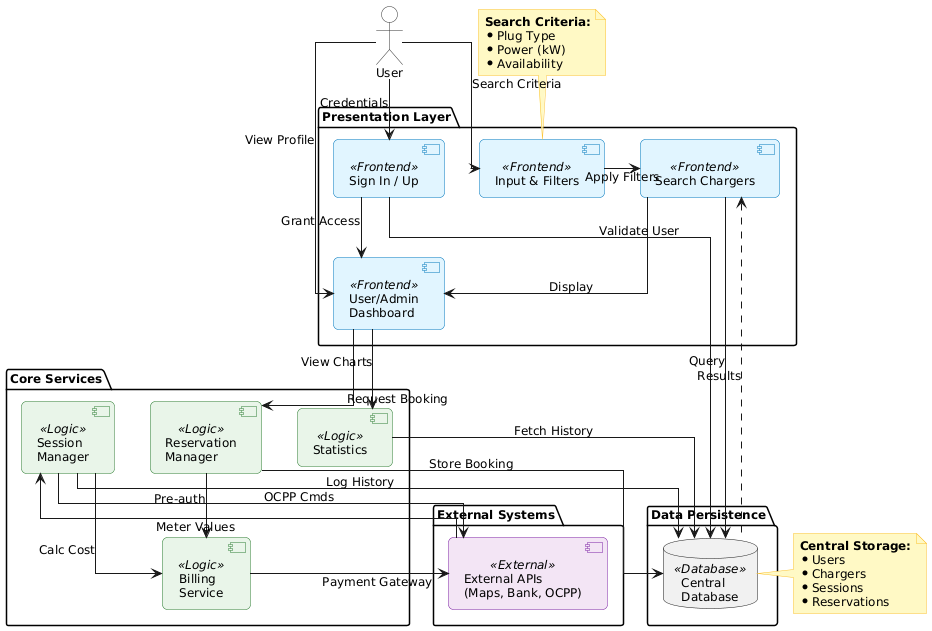

### 1.2 Interfaces

#### 1.2.1 Interfaces to external systems

Το λογισμικό αλληλεπιδρά με τα εξής εξωτερικά συστήματα:

- **Identity Providers:** Για τη δημιουργία και τη σύνδεση χρήστη μέσω 3rd parties (όπως Google, META, Apple) 
- **Συστήματα Πληρωμών (Payment Gateways):** Για την προ-δέσμευση ποσών και την υλοποίηση συναλλαγών.
- **Υπηρεσία Εντοπισμού Τοποθεσίας (GPS):** Για την εύρεση της τρέχουσας τοποθεσίας του χρήστη (προαιρετικά).
- **Υπηρεσίες Χαρτών (Maps/Navigation):** (π.χ. Google Maps) Για απεικόνιση του δικτύου και την πλοήγηση προς τους φορτιστές.
- **Τρίτες Εφαρμογές (Aggregators):** Εξουσιοδοτημένες εφαρμογές που αντλούν δεδομένα κατάστασης φορτιστών.

\
**Πρότυπα & Πρωτόκολλα:**
- OCPP (Open Charge Point Protocol): Για την επικοινωνία των φορτιστών με το backend μέσω websockets. 
- HTTPS/TLS 1.3: Για ασφαλή δικτυακή επικοινωνία με το backend/ τους φορτιστές μέσω REST API (JSON/CSV).
- PCI-DSS: Πρότυπα ασφαλείας για προστασία προσωπικών δεδομένων και atomic τραπεζικές συναλλαγές (ACID).
- OAuth : Για την ασφαλή ταυτοποίηση του χρήστη κατά την είσοδό του στην εφαρμογή.

**Component Diagram**

#### 1.2.2 User Interfaces

Η διεπαφή χρήστη αφορά κυρίως την δικτυακή εφαρμογή για τον πελάτη που παρέχει και τη δυνατότητα προβολής στο κινητό, η οποία περιλαμβάνει τις εξής οθόνες:

- **Οθόνη Εισόδου/Εγγραφής:** Για την ασφαλή ταυτοποίηση του χρήστη. Η σύνδεση δεν είναι υποχρεωτική, καθώς ο χρήστης μπορεί να δει το δίκτυο ανώνυμα εάν το επιθυμεί, με απενεργοποιημένη τη δυνατότητα δέσμευσης και φόρτισης.

  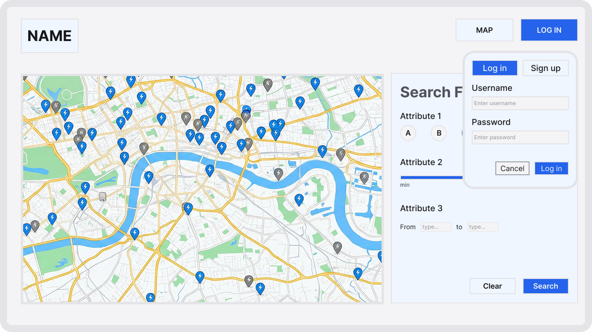

- **Χάρτης/Αναζήτηση:** Εμφάνιση σημείων φόρτισης, φίλτρα διαθεσιμότητας και επιλογή για πλοήγηση ή δέσμευση.

  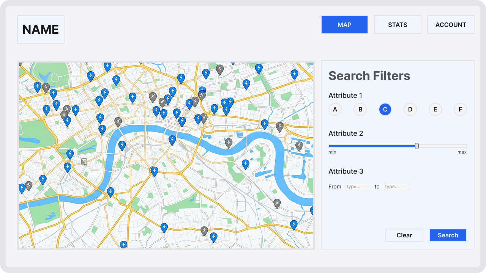

- **Οθόνη Φορτιστή:** Εμφάνιση λεπτομερειών του επιλεγμένου φορτιστή και επιλογές δέσμευσης ή έναρξης φόρτισης.

  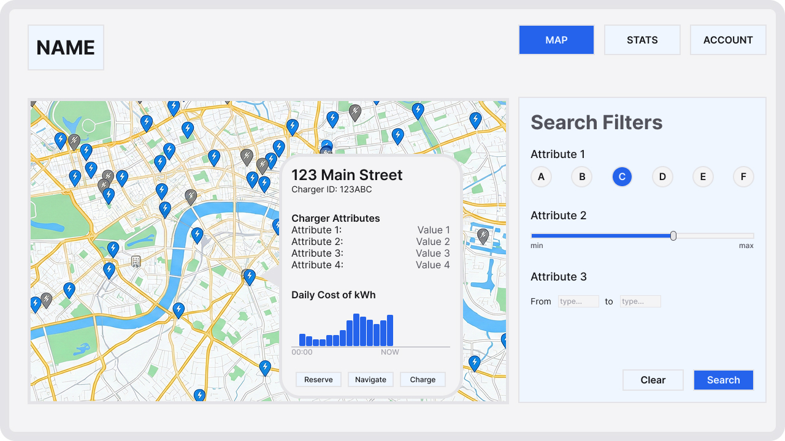

- **Συνεδρία Φόρτισης (Live):** Οθόνη που εμφανίζει την πρόοδο (%, kWh, τρέχον κόστος) και κουμπί τερματισμού.

  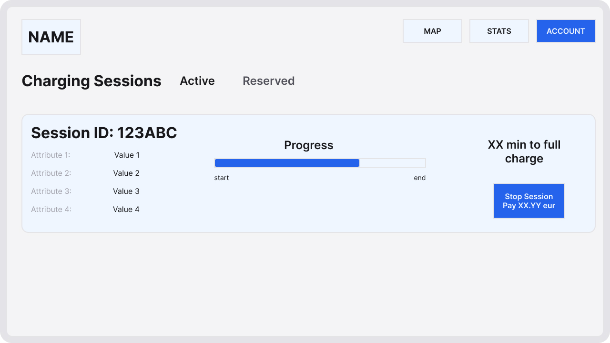

- **Στατιστικά Χρήστη:** Οθόνη που εμφανίζει στατιστικά σχετικά με την δραστηριότητα του χρήστη (δαπάνες/κατανάλωση σε kWh ανά συγκεκριμένα χρονικά διαστήματα, μέσος χρόνος φόρτισης, πιο συχνά σημεία φόρτισης κ.α).

  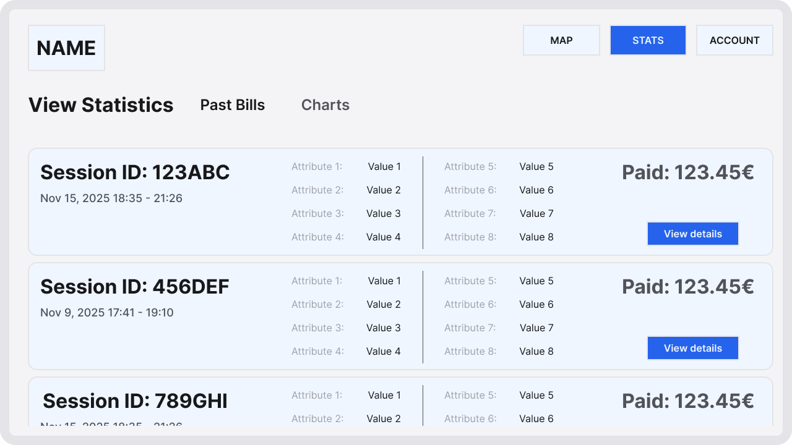

- **Στατιστικά Διαχειριστή:** Οθόνη που παρέχει συνολική εικόνα για την απόδοση του δικτύου φορτιστών (συνολικά έσοδα, κατανάλωση σε kWh, πλήθος συνεδριών ανά χρονικό εύρος), με στοιχεία για την πληρότητα των σταθμών (utilization), τον εντοπισμό ωρών αιχμής και αναλυτικές αναφορές βλαβών ανά σταθμό ή περιοχή.

  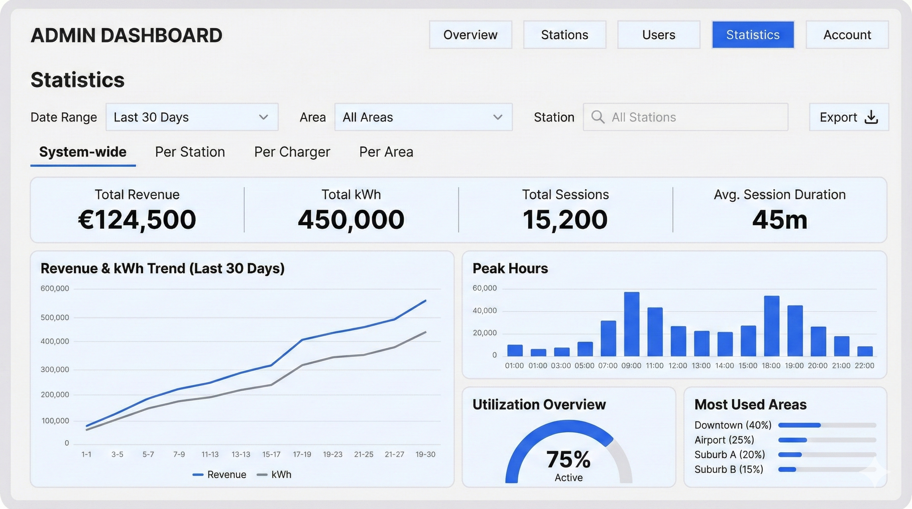

---

## 2. References

- `project_softeng2025_part1_v01_published.pdf`: Εκφώνηση εργασίας.
- `ISO/IEC/IEEE 29148:2018`: Διεθνές πρότυπο για τη συγγραφή SRS.
- `https://www.visual-paradigm.com/guide/`: Οδηγοί του Visual Paradigm για τους τύπους διαγραμμάτων UML

**Glossary:**

| Όρος | Ορισμός |
|------|---------|
| **Session** | Η διαδικασία φόρτισης από την έναρξη μέχρι τον τερματισμό |
| **CPO** | Charge Point Operator (Πάροχος) |
| **CLI** | Διεπαφή Γραμμής Εντολών (εργαλείο διαχείρισης για τον Πάροχο) |

---

## 3. Software requirements

Το σύστημα υποστηρίζει δύο βασικούς ρόλους χρηστών (**Πελάτης**, **Διαχειριστής**) και τις λειτουργίες που αντιστοιχούν σε αυτούς.

### 3.1 Use Cases

#### 3.1.1 Use case 1: Find and Navigate

Το use case περιγράφει τη διαδικασία κατά την οποία ο User εντοπίζει έναν διαθέσιμο φορτιστή σύμφωνα με τα κριτήριά του, τον επιλέγει από την απεικόνιση του χάρτη και στη συνέχεια μεταφέρεται σε εξωτερική υπηρεσία πλοήγησης (Maps & Navigation Service) με σκοπό την καθοδήγηση προς το σημείο φόρτισης.

##### 3.1.1.1 Roles involved

- **User**: Ο τελικός χρήστης που αλληλεπιδρά με την πλατφόρμα.  
- **Maps & Navigation Service**: Εξωτερική υπηρεσία απεικόνισης χαρτών και παροχής πλοήγησης.  
- **Device Location Service**: Υπηρεσία εντοπισμού θέσης της συσκευής του User (προαιρετική).

##### 3.1.1.2 Preconditions

- Ο User διαθέτει ενεργή σύνδεση στο διαδίκτυο.  
- Η Maps & Navigation Service είναι διαθέσιμη.  
- Ο browser του User υποστηρίζει διαδραστικούς χάρτες.  
- Η χρήση της τοποθεσίας της συσκευής επιτρέπεται μόνο εφόσον ο User έχει παράσχει ρητή συναίνεση.  
- Ο User δεν απαιτείται να διαθέτει λογαριασμό για την εκτέλεση του use case.
- Ο User μπορεί να είναι συνδεδεμένος στον λογαριασμό του ή να πραγματοποιεί συνεδρία επισκέπτη.

##### 3.1.1.3 Execution environment

- Web-based frontend προσβάσιμο από σύγχρονο browser.  
- Προαιρετικά: συσκευή με διαθέσιμο API εντοπισμού θέσης.

##### 3.1.1.4 Input data

- Επιλεγμένες παράμετροι αναζήτησης (φίλτρα).  
- Αναγνωριστικό του φορτιστή που επιλέγει ο User.  
- Απόφαση του User σχετικά με τη χρήση της τοποθεσίας της συσκευής.

##### 3.1.1.5 Expected behaviour

###### Main Flow

  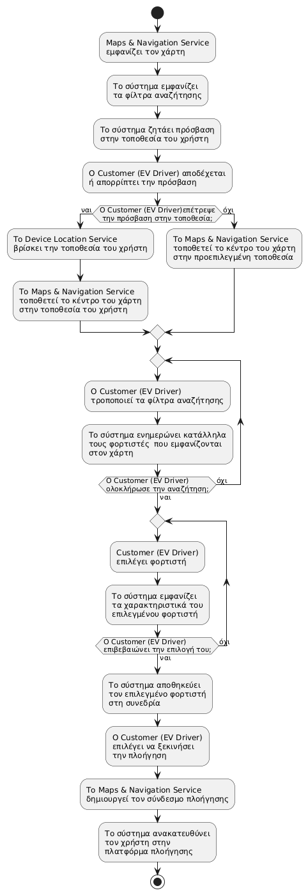

###### Alternate Flows

**Alternate flow 1: Υπάρχει αποθηκευμένος φορτιστής στη συνεδρία**

  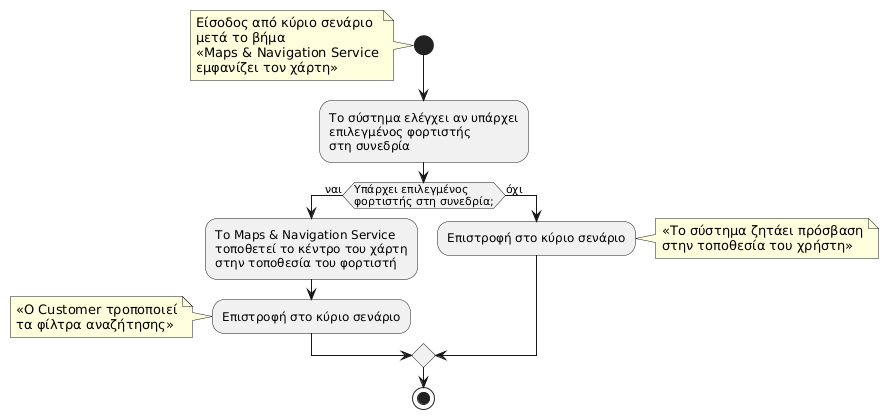

**Alternate flow 2: Τα φίλτρα του χρήστη δεν αντιστοιχούν σε διαθέσιμο φορτιστ**

  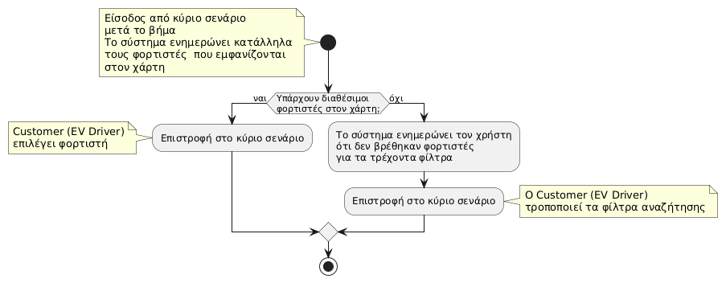

##### 3.1.1.6 Output data and postconditions

**Output data**

- Ενημερωμένη απεικόνιση διαθέσιμων φορτιστών στον χάρτη.  
- Πληροφορίες επιλεγμένου φορτιστή.  
- Σύνδεσμος πλοήγησης προς τον επιλεγμένο φορτιστή.  
- Διατήρηση της επιλογής φορτιστή στην τρέχουσα συνεδρία.

**Postconditions**

- Σε επιτυχή ολοκλήρωση:
  - Έχει οριστεί ένας επιλεγμένος φορτιστής για την τρέχουσα συνεδρία.  
  - Έχει εκκινηθεί διαδικασία πλοήγησης προς τον επιλεγμένο φορτιστή μέσω της Maps & Navigation Service.  

- Σε αποτυχία ή διακοπή:
  - Δεν έχει οριστεί φορτιστής για τη συνεδρία.  
  - Δεν έχει δημιουργηθεί ή χρησιμοποιηθεί σύνδεσμος πλοήγησης.

##### 3.1.1.7 Notes

- Η διαδικασία πλοήγησης εξαρτάται από τη διαθεσιμότητα της Maps & Navigation Service.  
- Η τοποθεσία του User δεν αποθηκεύεται μόνιμα και δεν διατηρείται ιστορικό τοποθεσίας.  
- Όλες οι επιλογές φίλτρων προέρχονται από προκαθορισμένο σύνολο τιμών που παρέχει το σύστημα.

---

#### 3.1.2 Use case 2: Reserve Charger
Ο εγγεγραμμένος χρήστης κάνει κράτηση ενός φορτιστή για συγκεκριμένο χρονικό διάστημα για να διασφαλίσει τη διαθεσιμότητα κατά την άφιξή του. Η κράτηση περιλαμβάνει προεξόφληση ποσού και διασφαλίζει την αποκλειστική χρήση του φορτιστή για το επιλεγμένο χρονικό διάστημα.

##### 3.1.2.1 Roles involved
- **EV Driver (Registered)** - Κύριος χρήστης που πραγματοποιεί την κράτηση
- **Payment Gateway** - Εξωτερικό σύστημα πληρωμών για προεξόφληση
- **Backend System** - Κεντρικό σύστημα διαχείρισης φορτιστών και κρατήσεων
- **Notification Service** - Σύστημα ειδοποιήσεων για επιβεβαιώσεις και υπενθυμίσεις

##### 3.1.2.2 Preconditions
- Ο χρήστης είναι πιστοποιημένος και συνδεδεμένος στην εφαρμογή
- Ο φορτιστής βρίσκεται σε κατάσταση "Διαθέσιμος" (Available)
- Ο χρήστης έχει επαληθευμένο και έγκυρο τρόπο πληρωμής στο προφίλ του
- Η συσκευή έχει ενεργή σύνδεση στο διαδίκτυο
- Ο χρήστης έχει αποδεχτεί τους όρους χρήσης για κρατήσεις
- Ο λογαριασμός του χρήστη δεν έχει περιορισμούς ή εκκρεμή χρέη

##### 3.1.2.3 Execution environment
Web πλατφόρμα ή Mobile εφαρμογή (Android/iOS) με υποστήριξη για ειδοποιήσεις push και πληρωμές online

##### 3.1.2.4 Input data
- **Αναγνωριστικό Φορτιστή (Charger ID)**: Μοναδικός κωδικός του επιλεγμένου φορτιστή
- **Διάρκεια Κράτησης**: Ορίζεται δυναμικά από τον διαχειριστή δικτύου σε επίπεδο φορτιστή (15-60 λεπτά), βάσει των στατιστικών χρήσης και πληρότητας που παρέχει το σύστημα. Αυτή η ευελιξία επιτρέπει στον πάροχο να προσαρμόζει τη διάρκεια κράτησης ανά περιοχή ή σταθμό, ώστε να βελτιστοποιεί τη διαθεσιμότητα και να αποσυμφορεί τα σημεία υψηλής ζήτησης.
- **Ώρα Έναρξης**: Προγραμματισμένη ώρα έναρξης φόρτισης
- **Μέθοδος Πληρωμής**: Επιλεγμένος τρόπος πληρωμής από το προφίλ χρήστη
- **Καταχωρημένο Όχημα Χρήστη**: Τύπος και μοντέλο οχήματος για στατιστικούς λόγους (προεραιτικό)

##### 3.1.2.5 Expected behaviour

**Main flow**

  

**Alternate flow 1: Χειροκίνητη Ακύρωση (User Cancellation)**

Ο χρήστης αποφασίζει να ακυρώσει την κράτηση πριν φτάσει στον φορτιστή.

  

**Alternate flow 2: Λήξη Χρόνου / No-Show (Timer Expiry)**

Ο χρήστης δεν εμφανίζεται εντός του καθορισμένου χρονικού ορίου.

  

##### 3.1.2.6 Output data and postconditions
**Output data:**
- Μοναδικό Αναγνωριστικό Κράτησης (Reservation ID)
- Επιβεβαίωση κράτησης με λεπτομέρειες (χρόνος, κόστος προ-δέσμευσης)
- Ειδοποίηση μέσω email/SMS/push notification

**Postconditions:**
- Σε επιτυχή ολοκλήρωση:
  - Ο φορτιστής έχει αλλάξει κατάσταση σε "Κρατημένος"
  - Έχει γίνει προεξόφληση ποσού μέσω Payment Gateway
  - Έχει ενεργοποιηθεί χρονόμετρο κράτησης
  - Ο χρήστης έχει λάβει επιβεβαίωση κράτησης
- Σε αποτυχία:
  - Ο φορτιστής παραμένει διαθέσιμος
  - Δεν έχει γίνει χρέωση

##### 3.1.2.7 Notes
- Η διάρκεια κράτησης είναι περιορισμένη (15-60 λεπτά) για να αποφευχθεί η μακροχρόνια δέσμευση φορτιστών
- Σε περίπτωση no-show, το τέλος ακύρωσης είναι προαιρετικό και καθορίζεται από την πολιτική του παρόχου
- Ο χρήστης μπορεί να έχει μόνο μία ενεργή κράτηση τη φορά

#### 3.1.3 Use Case 3: Display User Statistics

Η περίπτωση χρήσης αυτή περιγράφει τη διαδικασία με την οποία ο εγγεγραμμένος χρήστης (EV Driver) βλέπει στατιστικά στοιχεία και το ιστορικό των φορτίσεών του. Το σύστημα διαχωρίζει την πληροφόρηση σε αναλυτική (για το τελευταίο εξάμηνο) και συγκεντρωτική (για παλαιότερες περιόδους).

##### 3.1.3.1 Roles involved

- **EV Driver (Registered):** Ο εγγεγραμμένος χρήστης που επιθυμεί να ελέγξει την κατανάλωση και το κόστος των φορτίσεών του.
- **Database and Backend System:** Σύστημα αποθήκευσης και ανανέωσης (κατόπιν αιτήματος ή αυτόματα, π.χ. μηνιαία) στατιστικών μέσω της βάσης δεδομένων.
- **Frontend System:** Απεικόνιση στατιστικών στον χρήστη.
- **Notification System (προαιρετικό):** Ενημέρωση χρήστη ότι τα στατιστικά του είναι έτοιμα στην αλλαγή του μήνα.

##### 3.1.3.2 Preconditions

- Ο χρήστης έχει συνδεθεί επιτυχώς στον λογαριασμό του (authentication) και είναι εγγεγραμμένος στο σύστημα.
- Υπάρχουν καταγεγραμμένες συνεδρίες φόρτισης και πληρωμών στη βάση δεδομένων που σχετίζονται με τον λογαριασμό του χρήστη.

##### 3.1.3.3 Execution environment

- Web-based frontend προσβάσιμο από σύγχρονο browser.

##### 3.1.3.4 Input data

- Επιλογή μεταξύ συγκεντρωτικών ή αναλυτικών στατιστικών.
  - **Συγκεντρωτικά στατιστικά:** Ημερομηνία έναρξης και ημερομηνία λήξης.
  - **Αναλυτικά στατιστικά:** Επιλογή ενός μήνα ή εύρους μηνών μέσα από τους τελευταίους έξι μήνες.

##### 3.1.3.5 Expected behaviour

**Main flow**

  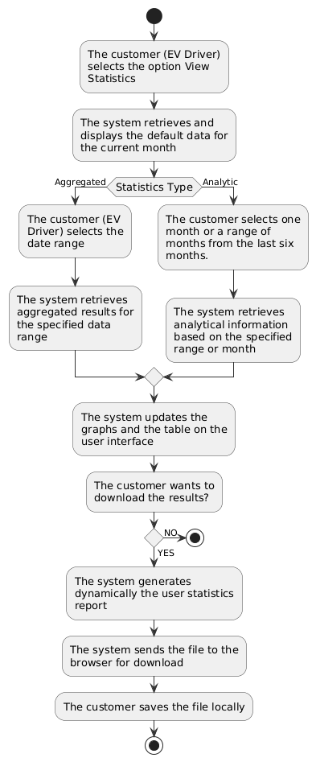

##### 3.1.3.6 Output data and postconditions

**Output data**

- Εμφάνιση στατιστικών στην οθόνη (view only), εφόσον δεν επιλεγεί εξαγωγή.
- Λήψη και αποθήκευση αρχείου PDF τοπικά, εφόσον επιλεγεί εξαγωγή.

**Postconditions**

- Σε επιτυχή ολοκλήρωση:
  - Ο χρήστης έχει δει ή/και αποθηκεύσει τα στατιστικά του.
- Σε αποτυχία:
  - Εμφανίζεται κατάλληλο μήνυμα για έλλειψη δεδομένων ή σφάλμα εξαγωγής.

##### 3.1.3.7 Notes 
- Data Aggregation Strategy: Για διαστήματα μεγαλύτερα του εξαμήνου, το σύστημα επιστρέφει προσυμπληρωμένα (pre-calculated) αθροίσματα ανά μήνα, ώστε να ελαχιστοποιείται ο χρόνος απόκρισης της βάσης δεδομένων.
- Σε περίπτωση που δεν υπάρχουν δεδομένα για την επιλεγμένη περίοδο, το PDF που παράγεται και το user interface θα περιέχει σχετική ένδειξη ("No data found").
- Δημιουργία Αναφοράς: Η διαδικασία δημιουργίας του PDF (Report Generation) εκτελείται ασύγχρονα στον server για να μην επιβαρύνει την απόκριση του User Interface, ειδικά όταν ζητείται μεγάλος όγκος δεδομένων
- Σε περίπτωση που ο χρήστης επιθύμει να δει αναλυτικά στατιστικά του θα πρέπει να επικοινωνήσει με τα κεντρικά. 

#### 3.1.4 Use case 4: Display Admin Statistics

Ο διαχειριστής δικτύου (CPO) ή κάποιο λογιστικό στέλεχος της εταιρείας που επιθυμεί ανάλυση της επίδοσης του δικτύου,  αποκτά πρόσβαση στον πίνακα ελέγχου (Dashboard) για να παρακολουθήσει την απόδοση του δικτύου φόρτισης. Η λειτουργία επιτρέπει την απεικόνιση κρίσιμων μετρήσεων (όπως έσοδα, κατανάλωση ενέργειας, βλάβες) και την ανάλυση δεδομένων σε διαφορετικά επίπεδα (συνολικά, ανά περιοχή, ανά σταθμό ή ανά φορτιστή), καθώς και την εξαγωγή αναφορών για περαιτέρω επεξεργασία. 

##### 3.1.4.1 Roles involved

- **Administrator** - Ο διαχειριστής που επιθυμεί να ελέγξει την απόδοση και να λάβει επιχειρηματικές αποφάσεις
- **Backend System** - Το σύστημα που συγκεντρώνει, επεξεργάζεται και σερβίρει τα ιστορικά δεδομένα
- **Database** - Η βάση δεδομένων που αποθηκεύει τα αρχεία καταγραφής (logs) των συνεδριών και των βλαβών

##### 3.1.4.2 Preconditions
- Ο χρήστης είναι πιστοποιημένος και συνδεδεμένος στην εφαρμογή διαχείρισης
- Ο χρήστης διαθέτει δικαιώματα "Admin" ή "Manager"
- Υπάρχουν καταγεγραμμένα ιστορικά δεδομένα φόρτισης και συναλλαγών στο σύστημα
- Η συσκευή έχει ενεργή σύνδεση στο διαδίκτυο

##### 3.1.4.3 Execution environment
Web Admin Portal (βελτιστοποιημένο για Desktop ή Smartphone) με δυνατότητες οπτικοποίησης δεδομένων (Data Visualization / Charts)

##### 3.1.4.4 Input data
- **Χρονικό Εύρος (Date Range)**: Η περίοδος αναφοράς (π.χ., Τελευταίες 30 μέρες, Προσαρμοσμένο Εύρος)
- **Κατηγορία Προβολής (View Category)**: Η επιλογή επιπέδου ανάλυσης (System-wide, Per Station, Per Area, Per Charger)
- **Φίλτρα Περιοχής/Σταθμού**: Επιλογή συγκεκριμένων γεωγραφικών περιοχών ή ID σταθμών για εστίαση
- **Μορφή Εξαγωγής (Export Format)**: Επιλογή τύπου αρχείου (CSV για επεξεργασία, PDF για παρουσίαση)

##### 3.1.4.5 Expected Behavior

**Main Flow**

  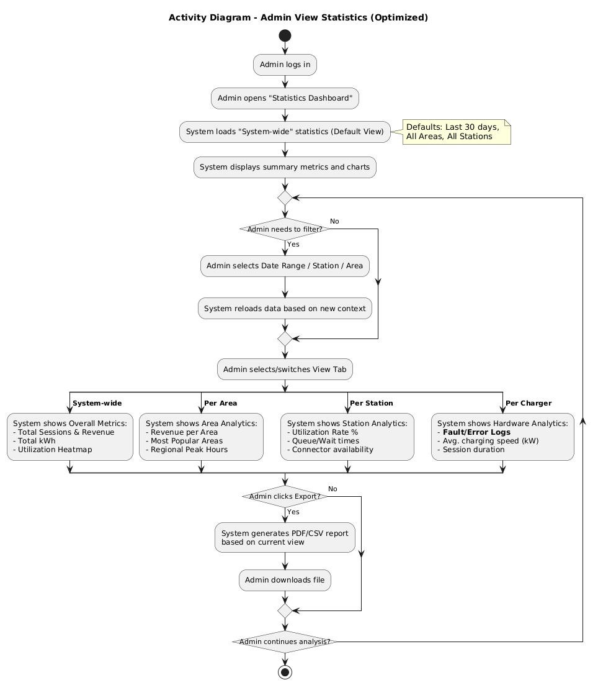

##### 3.1.4.6 Output data and postconditions
**Output data:**
- KPI Cards: Συνοπτικές κάρτες μετρικών (Σύνολο Εσόδων, Σύνολο kWh, Αριθμός Συνεδριών)
- Γραφήματα (Charts):
  - Χάρτης θερμότητας χρήσης (Utilization Heatmap)
  - Καμπύλες εσόδων ανά ημέρα/ώρα
  - Ποσοστά διαθεσιμότητας φορτιστών
  - Λίστες Συμβάντων: Καταγραφή σφαλμάτων (Fault/Error Logs) για την προβολή "Per Charger"
- Αρχείο Αναφοράς: Το αρχείο (PDF/CSV) που κατεβαίνει τοπικά στη συσκευή

**Postconditions:**
- Σε επιτυχή ολοκλήρωση:
  - Τα δεδομένα στην οθόνη έχουν ενημερωθεί σύμφωνα με τα φίλτρα
  - (Σε περίπτωση εξαγωγής) Το αρχείο αναφοράς έχει αποθηκευτεί στη συσκευή του διαχειριστή
- Σε αποτυχία (π.χ., έλλειψη δεδομένων):
  - Εμφανίζεται μήνυμα "No Data Available" για τα επιλεγμένα φίλτρα
  - Το σύστημα παραμένει στην προηγούμενη έγκυρη κατάσταση προβολής

##### 3.1.4.7 Notes
- Κατά την αρχική φόρτωση (Initial Load), το σύστημα εμφανίζει προεπιλεγμένα στατιστικά για τις "Τελευταίες 30 ημέρες" σε επίπεδο "System-wide" για άμεση πληροφόρηση
- Η προβολή "Per Charger" δίνει έμφαση σε τεχνικά δεδομένα (Fault Logs, Hardware status) σε αντίθεση με τις άλλες προβολές που εστιάζουν σε εμπορικά δεδομένα
- Τα δεδομένα είναι Read-Only (μόνο για ανάγνωση); ο διαχειριστής δεν μπορεί να τροποποιήσει τα ιστορικά στοιχεία μέσω αυτής της λειτουργίας

### 3.2 Functional Requirements

**Διάγραμμα Απαιτήσεων Συστήματος:**

  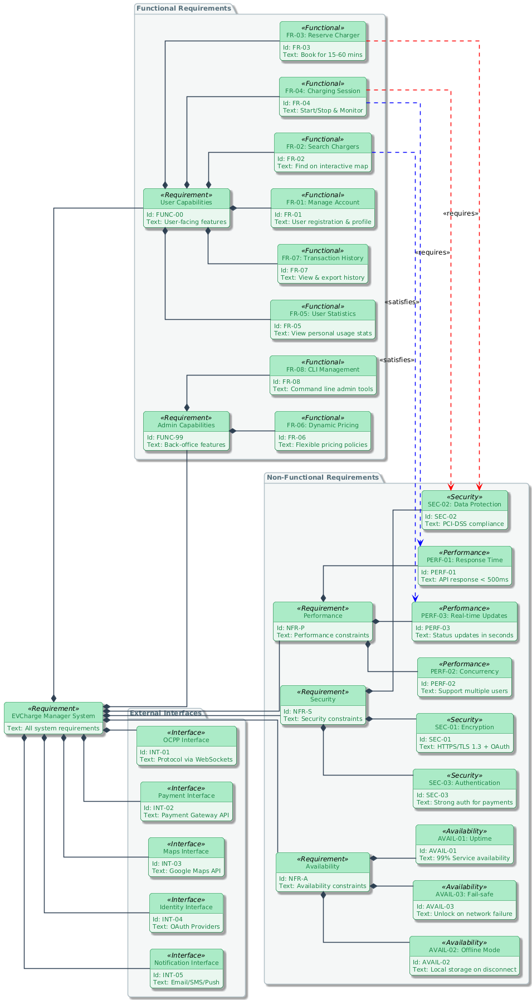

**Περιγραφή Λειτουργικών Απαιτήσεων:**

| Κωδικός | Τίτλος | Περιγραφή | Προτεραιότητα |
|---------|--------|-----------|---------------|
| **FR-01** | Διαχείριση Λογαριασμού | Δυνατότητα εγγραφής χρήστη (τοπικά ή με 3rd party OAuth), επεξεργασίας προφίλ, διαχείρισης μέσων πληρωμής και προτιμήσεων. Περιλαμβάνει: εγγραφή, σύνδεση, αποσύνδεση, επαναφορά κωδικού, επεξεργασία προφίλ. | Υψηλή |
| **FR-02** | Αναζήτηση Φορτιστών | Απεικόνιση φορτιστών σε διαδραστικό χάρτη με την επιλογή εφαρμογής φίλτρων (τύπος βύσματος, διαθεσιμότητα, ταχύτητα φόρτισης, απόσταση). Υποστήριξη αναζήτησης χωρίς λογαριασμό (guest mode). | Υψηλή |
| **FR-03** | Δέσμευση Φορτιστή | Δυνατότητα προγραμματισμένης δέσμευσης (reservation) φορτιστή για συγκεκριμένο χρονικό διάστημα (15-60 λεπτά). Περιλαμβάνει προεξόφληση ποσού, ειδοποιήσεις επιβεβαίωσης και δυνατότητα ακύρωσης. | Μέτρια |
| **FR-04** | Διαχείριση Φόρτισης | Λειτουργίες Start/Stop συνεδρίας φόρτισης και παρακολούθηση σε πραγματικό χρόνο (kWh, ποσοστό ολοκλήρωσης, κόστος). Υποστήριξη επικοινωνίας με φορτιστές μέσω OCPP. | Υψηλή |
| **FR-05** | Προβολή Στατιστικών | Απεικόνιση στατιστικών δραστηριότητας χρήστη: δαπάνες/κατανάλωση σε kWh ανά χρονικά διαστήματα, μέσος χρόνος φόρτισης, συχνότερα σημεία φόρτισης, γραφήματα τάσεων. | Χαμηλή |
| **FR-06** | Δυναμική Τιμολόγηση | Υποστήριξη ευέλικτων πολιτικών τιμολόγησης που μπορούν να αλλάζουν βάσει ώρας (peak/off-peak), ζήτησης, τοποθεσίας ή τύπου φορτιστή. Διαχείριση από τον πάροχο. | Μέτρια |
| **FR-07** | Ιστορικό Συναλλαγών | Τήρηση και προβολή πλήρους ιστορικού συνεδριών φόρτισης και οικονομικών συναλλαγών με δυνατότητα φιλτραρίσματος και εξαγωγής δεδομένων (CSV/PDF). | Μέτρια |
| **FR-08** | CLI Διαχείρισης | Παροχή εργαλείων γραμμής εντολών (CLI) για τον Πάροχο: διαχείριση φορτιστών (προσθήκη/επεξεργασία/απενεργοποίηση), εξαγωγή στατιστικών (συνολικά και ανά φορτιστή), διαχείριση χρηστών, ρύθμιση τιμολόγησης. | Μέτρια |

**Εξαρτήσεις μεταξύ Απαιτήσεων:**

- **FR-03** και **FR-04** απαιτούν το **FR-01** (αυθεντικοποίηση χρήστη)
- **FR-05** βασίζεται στο **FR-07** (ιστορικό δεδομένων)
- **FR-04** εφαρμόζει τις πολιτικές του **FR-06** (δυναμική τιμολόγηση)
- **FR-02** είναι προαπαιτούμενο για **FR-03** και **FR-04** (επιλογή φορτιστή)

**Περιορισμοί:**

- Όλες οι λειτουργίες πρέπει να είναι προσβάσιμες μέσω REST API
- Η επικοινωνία με φορτιστές (FR-04) πρέπει να συμμορφώνεται με το πρότυπο OCPP
- Οι οικονομικές συναλλαγές (FR-03, FR-04, FR-07) πρέπει να τηρούν το πρότυπο PCI-DSS

---

### 3.3 Performance Requirements

1. **Χρόνος Απόκρισης:** 
    - Η συνεδρία φόρτισης πρέπει να ξεκινάει σε λίγα δευτερόλεπτα από την στιγμή που ο χρήστης στέλνει την εντολή στην εφαρμογή ώστε να μην υπάρχει χρόνος αναμονής του χρήστη. 
    - Το REST API πρέπει να απαντά στο μεγαλύτερο ποσοστό των αιτημάτων ανάγνωσης δεδομένων σε λιγότερο από **500 ms** υπό κανονικό φορτίο.

2. **Ταυτοχρονισμός:** 
    - Το σύστημα (backend) πρέπει να υποστηρίζει πολλαπλά ταυτόχρονα sessions φόρτισης χωρίς καθυστερήσεις στην επικοινωνία.
    - Το σύστημα πρέπει να υποστηρίζει την ταυτόχρονη πρόσβαση πολλαπλών χρηστών. 

3. **Ενημέρωση Δεδομένων:**
    - Η αλλαγή στην κατάσταση ενός φορτιστή πρέπει να εμφανίζεται σε όλους τους χρήστες σε μερικά δευτερόλεπτα (real time updates) ώστε να μη γίνει εσφαλμένη δέσμευση/έναρξη συνεδρίας.
---

### 3.4 Data Requirements

#### 3.4.1 Data access requirements

- **Βάση Δεδομένων:** Χρήση σχεσιακής βάσης δεδομένων με RDBMS την PostgreSQL.
- **Πρόσβαση μέσω ORM**: Η διαχείριση της βάσης δεδομένων θα γίνεται μέσω επιπέδου αφαίρεσης ORM (Object-Relational Mapping) για την προστασία από επιθέσεις SQL Injection και την ευκολία συντήρησης του κώδικα.
- **API:** Η πρόσβαση στα δεδομένα από το Frontend και το CLI γίνεται αποκλειστικά μέσω REST API, με τα δεδομένα να δίνονται σε μορφές JSON και CSV.
- **Συνοχή Συναλλαγών (ACID):** Πρωτίστως οι οικονομικές συναλλαγές αλλά και οι αλλαγές κατάστασης συνεδρίας θα πρέπει να είναι αδιαίρετες, ώστε να μην υπάρχει διαφθορά στα δεδομένα.
- **Επικοινωνία με Hardware (Websockets)**: Επικοινωνία του server με τους φορτιστές μέσω websockets για παρακολούθηση της κατάστασής τους.
- **Ενημέρωση UI (Server Sent Events):** Eπικοινωνία του server με τους clients μέσω SSE ώστε να γίνεται ενημέρωση για την αλλαγή κατάστασης των φορτιστών.

#### 3.4.2 Semantic data model

Το σύστημα πρέπει να διατηρεί τις εξής κύριες οντότητες:

| Οντότητα | Περιγραφή & Λειτουργικός Ρόλος |
| :--- | :--- |
| **Χρήστης (User)** | Αντιπροσωπεύει το προφίλ του πελάτη που εγγράφεται στην πλατφόρμα. Περιλαμβάνει τα απαραίτητα στοιχεία για την ταυτοποίηση (login), ενώ συνδέεται άμεσα με τις αποθηκευμένες πιστωτικές κάρτες για την εκτέλεση των πληρωμών. |
| **Τοποθεσία (Location)** | Ορίζει τον φυσικό χώρο (π.χ. πάρκινγκ, λιμάνι) όπου φιλοξενούνται οι σταθμοί. Παρέχει τα δεδομένα πλοήγησης (διεύθυνση, συντεταγμένες) και καθορίζει τη γενική προσβασιμότητα του χώρου (π.χ. αν είναι ανοιχτός ή υπό συντήρηση). |
| **Φορτιστής (Charger)** | Περιγράφει τον φυσικό εξοπλισμό φόρτισης. Συνδυάζει την κεντρική μονάδα (Station/EVSE) με τα επιμέρους βύσματα (Connectors), καθορίζοντας την τρέχουσα κατάσταση διαθεσιμότητας (π.χ. Διαθέσιμος, Κατειλημμένος) και την ταχύτητα φόρτισης (kW). |
| **Συνεδρία (Session)** | Αποτελεί το ιστορικό αρχείο κάθε ολοκληρωμένης συναλλαγής. Συνδέει τον χρήστη με τον φορτιστή που χρησιμοποίησε και καταγράφει τα απολογιστικά στοιχεία της φόρτισης (χρόνος έναρξης/λήξης, συνολική ενέργεια και τελικό κόστος). |
| **Κράτηση (Reservation)** | Διατηρεί τα στοιχεία των ενεργών κρατήσεων, οι οποίες αφορούν έναν χρήστη και έναν φορτιστή. Λειτουργεί ως μηχανισμός εγγύησης διαθεσιμότητας, αποτρέποντας τη χρήση του εξοπλισμού από άλλους χρήστες μέχρι να λήξει το χρονικό περιθώριο ή να ξεκινήσει η φόρτιση. 

---

**ER Diagram**

  

### 3.5 Other requirements

#### 3.5.1 Availability

1. **Uptime:** Το σύστημα πρέπει να εγγυάται συγκεκριμένο και υψηλό ποσοστό διαθεσιμότητας (τάξης του 99%) σε βασικές λειτουργίες του συστήματος, καθώς η ανάγκη φόρτισης μπορεί να προκύψει ανά πάσα στιγμή. Λειτουργίες λιγότερο κρίσιμες (όπως η απεικόνιση στατιστικών) δε χρειάζονται τόσο υψηλό ποσοστό διαθεσιμότητας.
2. **Offline Λειτουργία:** Σε περίπτωση απώλειας επικοινωνίας με τον Server, οι φορτιστές πρέπει να μεταβαίνουν αυτόματα σε κατάσταση που αποθηκεύουν τα δεδομένα φόρτισης τοπικά και τα συγχρονίζουν με τον Server μόλις αποκατασταθεί η σύνδεση.
3. **Fail Safe Λήξη Συνεδρίας:** Πρέπει να υπάρχουν μηχανισμοί **fail-safe** ώστε οι φορτιστές να μην "κλειδώνουν" τα καλώδια των χρηστών σε περίπτωση απώλειας δικτύου.
4. **Συντήρηση:** Η συντήρηση που απαιτεί διακοπή της υπηρεσίας (downtime) πρέπει να είναι προγραμματισμένη για ώρες χαμηλής κινητικότητας και να γίνεται γνωστοποίησή της στους χρήστες εγκαίρως.

#### 3.5.2 Security

- Απαιτείται κρυπτογράφηση των ευαίσθητων δεδομένων αυθεντικοποίησης πριν την αποθήκευση. Μονόδρομη κρυπτογράφηση για κωδικούς (σύνδεση μέσω λογαριασμού της εφαρμογής) και αμφίδρομη για OAuth tokens (σύνδεση μέσω 3rd party). 
- Όλες οι επικοινωνίες (μεταξύ App, API, Server) πρέπει να είναι κρυπτογραφημένες (**HTTPS/TLS**).
- Τα ευαίσθητα δεδομένα πληρωμών δεν πρέπει να αποθηκεύονται στη βάση δεδομένων του συστήματος, αλλά να γίνεται χρήση tokens από τον πάροχο πληρωμών.
- Απαιτείται ισχυρή αυθεντικοποίηση (**Authentication**) για κάθε ενέργεια που επιφέρει οικονομική χρέωση.